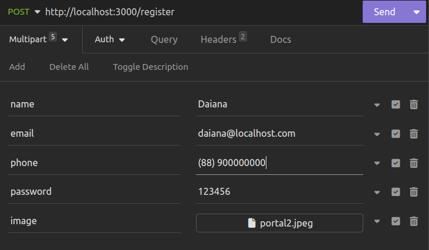

# **Portal Central - Desafio Normalabs**

Este projeto foi desenvolvido em resposta ao desafio proposto pela Normalabs, com o objetivo de criar um portal responsivo para dispositivos móveis. O portal oferece diversas funcionalidades por meio de rotas específicas.

## Funcionalidades
**Cadastrar Usuário:** `POST /register` - Cadastra um novo usuário, incluindo upload de imagem de perfil.

<details><summary>  
  Exemplo de requisição 
</summary>



</details>

<br>

**Fazer Login:** `POST /login` - Realiza o login do usuário, validando e autenticando as credenciais.

<details><summary>  
  Exemplo de requisição 
</summary>

```javascript
// POST / login
{
	"email": "daiana@localhost.com",
	"password": "123456"
}
```

</details>

<br>

---
### **Atenção!:** O usuário deverá ser identificado através do ID presente no token de autenticação.
---
<br>

**Detalhar Usuário:** `GET /users` - informações básicas do usuário.

<details><summary>  
  Exemplo de requisição 
</summary>

```javascript
// GET / users
//Sem conteúdo no corpo (body) da requisição
```

</details>

<br>

**Criar Ticket:** `POST /tickets` - Cria um novo ticket, incluindo validação necessária.

<details><summary>  
  Exemplo de requisição 
</summary>

```javascript
// POST / tickets
{
	"title": "atraso",
	"description": "aguardando pedido do piso",
	"status": "Aberto"
}
```

</details>

<br>

**Adicionar Comentário:** `POST /tickets/:id/comments` - Adiciona comentários a um ticket específico.

<details><summary>  
  Exemplo de requisição 
</summary>

```javascript
// POST / tickets / :id / comments
{
	"message": "meu pedido está atrasado uma semana"
}
```

</details>

<br>

**Atualizar Ticket:** `PUT /tickets/:id` - Atualiza informações de um ticket existente.

<details><summary>  
  Exemplo de requisição 
</summary>

```javascript
// PUT / tickets / :id
{
	"status": "Finalizado"
}
```

</details>

<br>

**Visualizar Comentários:** `GET /tickets/:id/comments` - Visualiza todos os comentários associados a um ticket.

<details><summary>  
  Exemplo de requisição 
</summary>

```javascript
// GET / tickets / :id / comments
//Sem conteúdo no corpo (body) da requisição
```
</details>

<br>

**Visualizar Tickets:** `GET /tickets` - Visualiza todos os tickets disponíveis.

<details><summary>  
  Exemplo de requisição 
</summary>

```javascript
// GET / tickets
//Sem conteúdo no corpo (body) da requisição
```
</details>

<br>

**Detalhar Ticket:** `GET /tickets/:id` - Visualiza detalhes de um ticket específico.

<details><summary>  
  Exemplo de requisição 
</summary>

```javascript
// GET / tickets / :id
//Sem conteúdo no corpo (body) da requisição
```

</details>

<br>

---
## Como Usar:

## Requisitos

- [Node.js](https://nodejs.org/)
- [Express.js](https://expressjs.com/)

## Instalação
### Rodando localmente:  
</summary>

1. Clone o projeto:

```bash
git clone https://github.com/Daian4/Portal.git
```

2. Abrir a pasta do projeto:

```bash
cd Portal
```

4. Instalar dependências:

```bash
npm install
```

5. Inicializar o servidor:

```bash
npm run start
```
6. Credenciais de teste
```bash
{
	"email": "carlos@localhost.com",
	"password": "123456"
}
```
## Contribuições

Contribuições são bem-vindas! Sinta-se à vontade para abrir um problema ou enviar um pull request.

## Tecnologias Ultilizadas 

[](https://skillicons.dev)

  <br/> 

## Licença

Este projeto está licenciado sob a [MIT License](LICENSE).


